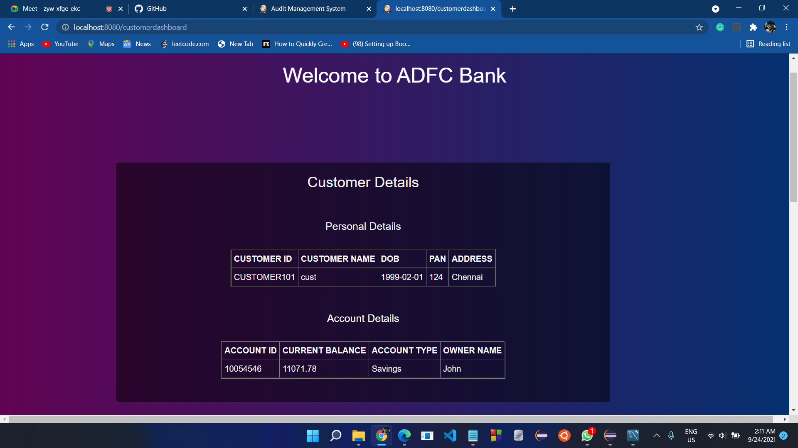

# Retail-Bank-Management-Microservices
   This project is based on Retail Banking System with two way authentication where Employee has full access whereas limited access to customer to deal with daily transaction in Retail Bank.
   

# Technologies Used
     => Spring boot/MVC/Spring Tool Suite
     => JWT and spring security
     => JSP and CSS for web design
     => Git bash

# Database
     => H2 Database

# Deployment and Orchestartion tools
     => Docker
     => AWS Fargate
     => ECS for Containerization
     => ECR for Clusters
     => AWS IAM role for specific role
     => AWS Code Commit
     => AWS Code Build
# Unit Testing
     => Junit testing
     
# Screenshots
    
    
    
    
    
    

    
  
